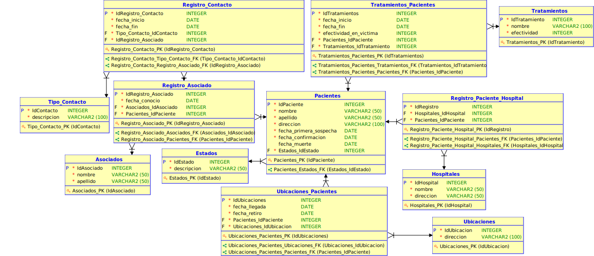

# Manual Tecnico 

| Nombre | Carnet |
| ------------- | ------------- |
| Oscar Daniel Oliva España          | 201902663 |

## BackEnd

> Python

Se utilizó Python para realizar el BackEnd, con la aplicación 'FastApi', con la que se realizaron 14 endpoints (funciones), uno para cada consulta requerida.

Desde el mismo FASTAPI se manda a llamar a la base de datos con el tsname.ora que contiene los datos del servicio, tal como la IP, protocolo, etc..., el cual se encuentra dentro del instantclient de oracle.

## Base de Datos
> Oracle

Se utilizó Oracle dentro de una instancia de Google Cloud Platform con OS Ubuntu 20.04, en donde se activo en firewall el puerto 1521.

Dentro de la instancia se instaló docker y se utilizó una imagen de oracle

## Instalar oracle
    sudo apt update
    sudo apt install apt-transport-https ca-certificates curl software-properties-common
    curl -fsSL https://download.docker.com/linux/ubuntu/gpg | sudo apt-key add -
    sudo add-apt-repository "deb [arch=amd64] https://download.docker.com/linux/ubuntu focal stable"
    sudo apt update
    apt-cache policy docker-ce

## Instalacion de oracle 18C
    sudo docker pull dockerhelp/docker-oracle-ee-18c

    sudo docker run -it -d -p 1521:1521 --name=oracle dockerhelp/docker-oracle-ee-18c /bin/bash

## Entrar a oracle con exec

	docker start <nombre contenedor>

    sudo docker exec -it oracle /bin/bash

    sh post_install.sh

## Cada vez que se apague el contendeor o reinice la instancia, se deben de hacer siempre los 2 comandos anteriores

DEBE DE APARECER EL MENSAJE QUE LA INSTANCIA DE ORACLE
YA SE INICIO

[oracle@5eec6d73a418 /]$ sqlplus
- Se ingresan las credenciales
- Si no se ha creado un usuario, se crea y se le agregan todos los permisos

## Modelos de la base de datos

### Conceptual

### Lógico

### Entidad Relación (ER)
